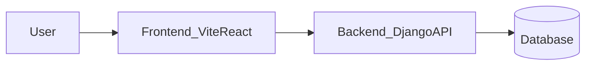

# UBOS

> Unified Business Operating System for service firms.

## Badges

[](https://github.com/TrevorPLam/OS/actions/workflows/ci.yml)
[](https://codecov.io/gh/TrevorPLam/OS)
[](https://coveralls.io/github/TrevorPLam/OS?branch=main)


Full-stack application with a Django backend and a `Vite`/React frontend.

## TL;DR

```sh
make setup
make dev
```

Run the local CI suite:

```sh
make ci
```

## Quick start

Prerequisites:

- Python 3.11
- Node.js 20
- Docker (optional, for services)

Setup:

- `make setup`

Run dev servers:

- `make dev`

Verify (local CI equivalent):

- `make verify`
- `make ci` (alias of `make verify`)

## What is UBOS

UBOS is a full-stack platform for managing client work, projects, billing, and operations in one place.

### Key features

- Client onboarding and firm management
- CRM and communications workflows
- Projects, documents, and approvals
- Billing, invoicing, and accounting integrations
- Security, audit, and compliance controls

## What is in this repo

`monorepo` with a Django API and a `Vite`/React client.

### Tech stack

- Backend: Django, `pytest`, ruff, black, `mypy`
- Frontend: `Vite`, React, TypeScript, Playwright

### Repository layout

- `backend/` Django API and services
- `frontend/` `Vite`/React client
- `tests/` cross-cutting and integration tests
- `docs/` onboarding, development, and architecture notes

## Golden commands

- `make setup` install backend/frontend dependencies
- `make lint` run linters
- `make test` run test suites
- `make verify` run the local CI suite (defaults to light checks)
- `make verify SKIP_HEAVY=0` run the full suite (tests/build/OpenAPI)
- `make ci` alias of `make verify` (used by CI)

## Configuration

- Copy `.env.example` to `.env` and fill in values.
- Backend reads environment variables for database, secrets, and local KMS settings.

## Docker (optional)

Use Docker Compose for local services:

```sh
docker compose up -d
```

## Architecture



## Screenshots

Add product screenshots to `docs/assets/` and link them here.

## Documentation

- [`docs/getting-started/onboarding.md`](docs/getting-started/onboarding.md)
- [`docs/development/README.md`](docs/development/README.md)
- [`docs/architecture/README.md`](docs/architecture/README.md)
- [`docs/operations/README.md`](docs/operations/README.md)

## Roadmap

- Improve onboarding flows and admin controls
- Expand analytics dashboards
- Harden observability and audit tooling
- Broaden integrations (billing, CRM, email)

## FAQ / Troubleshooting

- Setup fails on Windows:
  - Ensure Python 3.11 and Node 20 are available in PATH.
  - Re-run `make setup` after upgrading.
- Backend tests fail locally:
  - Confirm DB config in `.env` or use `USE_SQLITE_FOR_TESTS=True`.
- Frontend tests fail:
  - Run `make -C frontend setup` and retry.

## CI

GitHub Actions runs `make ci` on pull requests and main branch.
