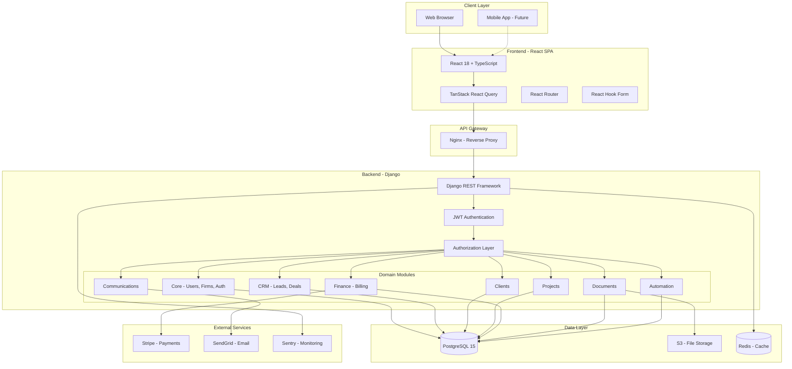
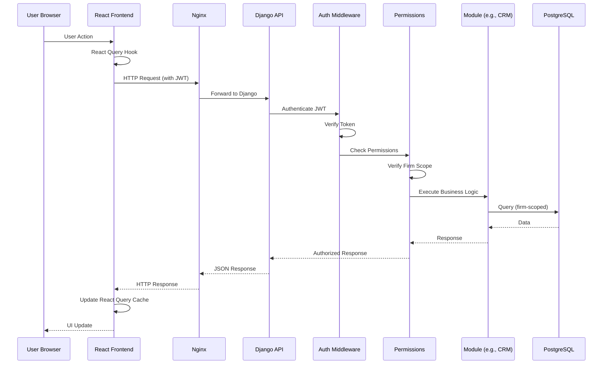
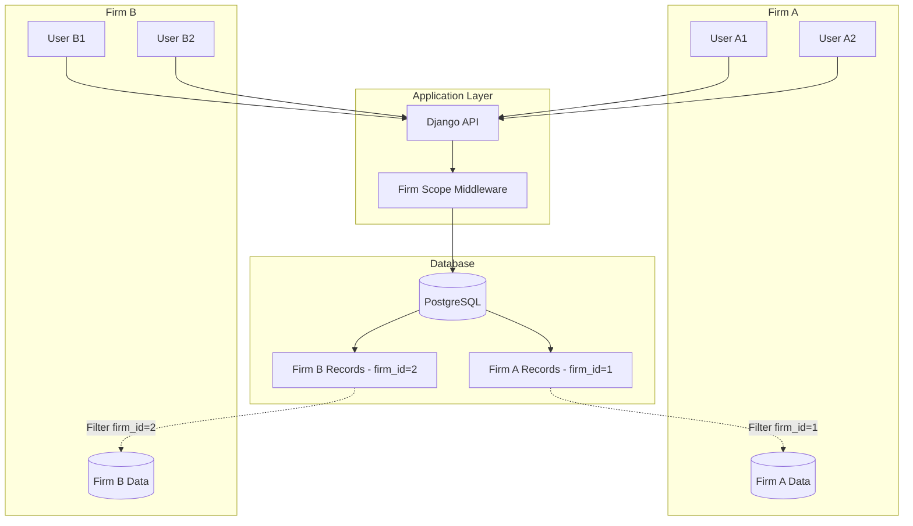
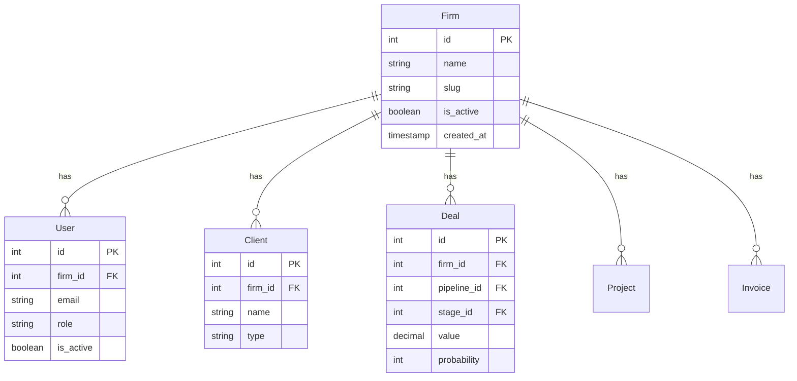
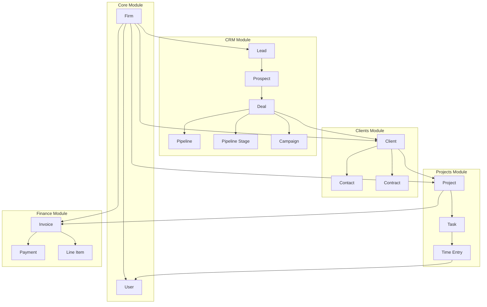
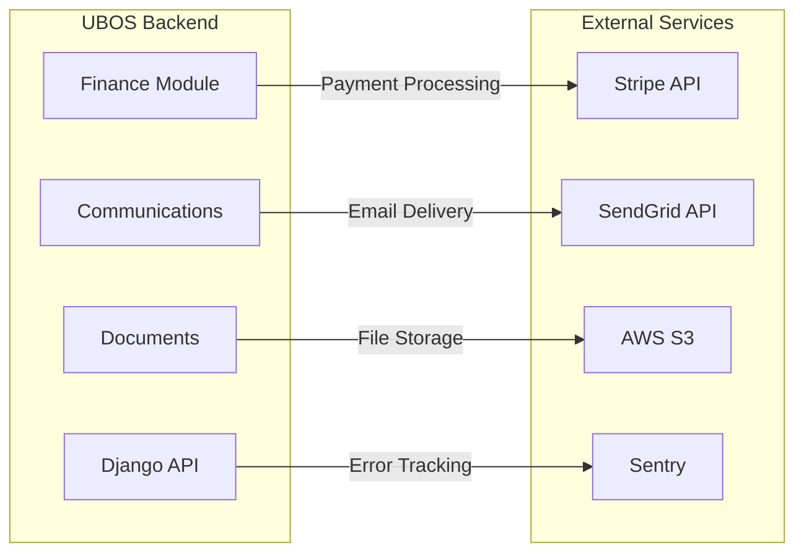
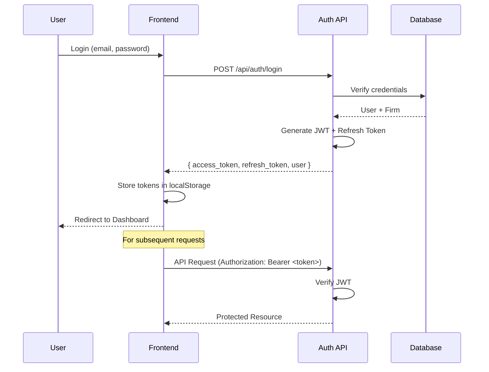
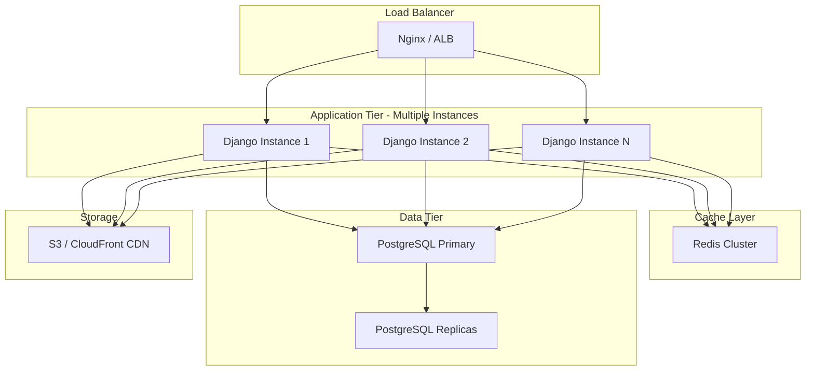

# UBOS System Architecture

This document provides a comprehensive overview of the UBOS (Unified Business Operating System) architecture, design decisions, and technical structure.

---

## 📋 Table of Contents

- [Overview](#overview)
- [High-Level Architecture](#high-level-architecture)
- [System Architecture Diagrams](#system-architecture-diagrams)
- [Component Architecture](#component-architecture)
- [Data Architecture](#data-architecture)
- [Module Organization](#module-organization)
- [Technology Stack](#technology-stack)
- [Architectural Principles](#architectural-principles)
- [Integration Patterns](#integration-patterns)
- [Security Architecture](#security-architecture)
- [Scalability & Performance](#scalability--performance)
- [Related Documentation](#related-documentation)

---

## Overview

UBOS is an enterprise-grade, unified platform for service firms built with modern, scalable architecture:

- **Multi-Tenant SaaS** - Firm-scoped data isolation at database level
- **Domain-Driven Design** - Organized by business domains/bounded contexts
- **API-First** - RESTful API with OpenAPI specification
- **Modern Stack** - Django 4.2 backend, React 18 frontend
- **Security-First** - Authentication, authorization, and audit built-in
- **Cloud-Native** - Container-ready, stateless services

### Key Characteristics

| Aspect | Approach |
|--------|----------|
| **Architecture Style** | Modular Monolith (microservices-ready) |
| **Data Model** | Multi-tenant with firm-scoped isolation |
| **API Design** | RESTful with Django REST Framework |
| **Frontend** | SPA (Single Page Application) |
| **Authentication** | JWT with refresh tokens |
| **Authorization** | Role-based + object-level permissions |
| **Deployment** | Docker containers, PostgreSQL database |

---

## High-Level Architecture



---

## System Architecture Diagrams

### Request Flow



### Multi-Tenancy Architecture



---

## Component Architecture

### Backend - Django Modules

```
backend/
├── config/              # Django settings and configuration
│   ├── settings.py     # Base settings
│   ├── urls.py         # Root URL configuration
│   └── wsgi.py         # WSGI application
│
└── modules/            # Domain modules (Django apps)
    ├── core/           # Infrastructure
    │   ├── models.py   # User, Firm, base models
    │   ├── auth.py     # JWT authentication
    │   ├── permissions.py
    │   └── middleware.py
    │
    ├── crm/            # Customer Relationship Management
    │   ├── models.py   # Lead, Prospect, Deal, Pipeline
    │   ├── serializers.py
    │   ├── views.py
    │   └── services.py # Business logic
    │
    ├── clients/        # Client Management
    │   ├── models.py   # Client, Contact
    │   ├── views.py
    │   └── portal.py   # Client portal logic
    │
    ├── projects/       # Project Delivery
    │   ├── models.py   # Project, Task, TimeEntry
    │   └── views.py
    │
    ├── finance/        # Billing & Invoicing
    │   ├── models.py   # Invoice, Payment
    │   ├── stripe.py   # Stripe integration
    │   └── views.py
    │
    ├── documents/      # Document Management
    │   ├── models.py   # Document, Version
    │   ├── storage.py  # S3 integration
    │   └── views.py
    │
    ├── communications/ # Messaging
    │   ├── models.py   # Message, Conversation
    │   └── views.py
    │
    └── automation/     # Workflows
        ├── models.py   # Workflow, Trigger, Action
        ├── engine.py   # Workflow execution
        └── views.py
```

### Frontend - React Structure

```
frontend/src/
├── api/                # API client layer
│   ├── client.ts      # Axios instance with auth
│   ├── auth.ts        # Auth API + hooks
│   ├── crm.ts         # CRM API + hooks
│   ├── clients.ts     # Clients API + hooks
│   └── [module].ts    # Other modules
│
├── pages/              # Route-level components
│   ├── Login.tsx
│   ├── Dashboard.tsx
│   ├── Clients.tsx
│   ├── crm/
│   │   ├── Deals.tsx
│   │   ├── Leads.tsx
│   │   └── PipelineKanban.tsx
│   └── [feature]/
│
├── components/         # Reusable UI components
│   ├── Sidebar.tsx
│   ├── LoadingSpinner.tsx
│   ├── ErrorBoundary.tsx
│   └── [component].tsx
│
├── hooks/              # Custom React hooks
│   ├── useAuth.ts
│   └── [hook].ts
│
├── types/              # TypeScript definitions
│   └── index.ts
│
├── utils/              # Utility functions
│   └── helpers.ts
│
├── App.tsx             # Root component + routing
└── main.tsx            # Application entry point
```

---

## Data Architecture

### Multi-Tenant Data Model

Every table in the database has a `firm_id` foreign key that links to the `core_firm` table. This ensures complete data isolation between tenants.



### Core Domain Models



---

## Module Organization

UBOS follows **Domain-Driven Design** principles with modules organized by business domain (bounded contexts):

### Module Ownership & Boundaries

| Module | Responsibility | Dependencies |
|--------|---------------|--------------|
| **core** | Infrastructure: Auth, Firms, Users | None (foundational) |
| **crm** | Sales pipeline: Leads → Deals | core |
| **clients** | Client relationships, portal | core, crm (optional) |
| **projects** | Project delivery, tasks, time | core, clients |
| **finance** | Billing, invoicing, payments | core, clients, projects |
| **documents** | Document storage, versioning | core, projects (optional) |
| **communications** | Messaging, conversations | core, clients |
| **automation** | Workflows, triggers, actions | core, all modules |
| **calendar** | Scheduling, events | core, clients |
| **support** | Ticketing, SLA management | core, clients |

### Module Interaction Rules

1. **Core → No dependencies** - Foundation for all modules
2. **Business modules → Core only** - Depend on core infrastructure
3. **Cross-module communication** - Through well-defined APIs (requires ADR)
4. **Automation module** - Can integrate with all modules (observer pattern)

---

## Technology Stack

### Backend Stack

| Technology | Version | Purpose |
|------------|---------|---------|
| **Python** | 3.11+ | Primary language |
| **Django** | 4.2 LTS | Web framework |
| **Django REST Framework** | 3.14+ | API framework |
| **PostgreSQL** | 15+ | Primary database |
| **Redis** | 7+ | Caching & sessions |
| **Celery** | 5.3+ | Async tasks (future) |
| **pytest** | 7.4+ | Testing framework |

### Frontend Stack

| Technology | Version | Purpose |
|------------|---------|---------|
| **React** | 18.3+ | UI library |
| **TypeScript** | 5.9+ | Type safety |
| **Vite** | 5.4+ | Build tool |
| **TanStack React Query** | 5.x | Data fetching & caching |
| **React Hook Form** | 7.x | Form management |
| **React Router** | 6.x | Client-side routing |
| **Vitest** | 1.x | Testing framework |
| **Playwright** | 1.x | E2E testing |

### Infrastructure

| Technology | Purpose |
|------------|---------|
| **Docker** | Containerization |
| **Nginx** | Reverse proxy |
| **GitHub Actions** | CI/CD |
| **AWS S3** | File storage |
| **Sentry** | Error tracking |
| **Stripe** | Payment processing |

---

## Architectural Principles

### 1. Multi-Tenancy
- **Firm-scoped isolation** at database level
- All tables have `firm_id` foreign key
- Queries automatically filtered by firm
- No cross-firm data access

### 2. Domain-Driven Design
- Modules organized by business domain
- Clear bounded contexts
- Ubiquitous language within modules
- Well-defined module boundaries

### 3. API-First Design
- RESTful API as primary interface
- OpenAPI specification (Swagger)
- Versioning strategy for breaking changes
- Consistent response formats

### 4. Security-First
- Authentication on every request
- Authorization checks at API and object level
- Input validation using serializers
- Audit logging for sensitive operations
- Secret management via environment variables

### 5. Scalability
- Stateless API services (scale horizontally)
- Database connection pooling
- Caching with Redis
- Async tasks with Celery (future)
- CDN for static assets

### 6. Performance
- Database query optimization (select_related, prefetch_related)
- API response caching
- Frontend code splitting
- React Query for client-side caching
- Pagination for large datasets

### 7. Maintainability
- Clear separation of concerns
- Comprehensive test coverage (80%+ backend, 60%+ frontend)
- Documentation as code
- Consistent code style (Black, Prettier, ESLint)
- Type safety (Python type hints, TypeScript)

---

## Integration Patterns

### External Service Integration



### Frontend-Backend Communication

- **Protocol**: HTTP/HTTPS (REST)
- **Format**: JSON
- **Authentication**: JWT Bearer tokens
- **Caching**: React Query on frontend, Redis on backend
- **Error Handling**: Standardized error responses

---

## Security Architecture

### Authentication Flow



### Authorization Layers

1. **Authentication**: JWT token verification
2. **Firm Scope**: Automatic filtering by user's firm
3. **Role-Based**: User roles (admin, manager, member)
4. **Object-Level**: Ownership and custom permissions
5. **Action-Level**: CRUD permissions per model

---

## Scalability & Performance

### Current Architecture (v0.1.0)
- **Single Django instance** behind Nginx
- **PostgreSQL** on separate container
- **Redis** for session and cache
- **S3** for file storage

### Future Scaling Path



### Performance Targets

| Metric | Target | Current Status |
|--------|--------|----------------|
| **API Response Time** | < 200ms (p95) | ✅ Meeting |
| **Database Query Time** | < 50ms (p95) | ✅ Meeting |
| **Frontend Load Time** | < 2s (LCP) | ✅ Meeting |
| **Concurrent Users** | 1000+ per instance | ✅ Meeting |
| **Database Connections** | 100 per instance | ✅ Meeting |

---

## Related Documentation

### Architecture Deep-Dives
- [Module Documentation](modules/README.md) - Detailed module documentation
- [Data Models](data-models/README.md) - Database schema and relationships
- [Design Decisions](decisions/README.md) - ADRs for key technical decisions

### Development & Operations
- [Development Guide](../development/README.md) - Development setup and practices
- [API Reference](../reference/api/) - API endpoint documentation
- [Operations](../operations/README.md) - Deployment and operations guide
- [Security](../security/README.md) - Security policies and procedures

### Product Context
- [PRODUCT.md](../../PRODUCT.md) - Product vision and business context
- [README.md](../../README.md) - Project overview
- [CONTRIBUTING.md](../../CONTRIBUTING.md) - Contribution guidelines

---

**Last Updated**: 2026-01-24  
**Document Version**: 2.0  
**Status**: Active - Comprehensive
